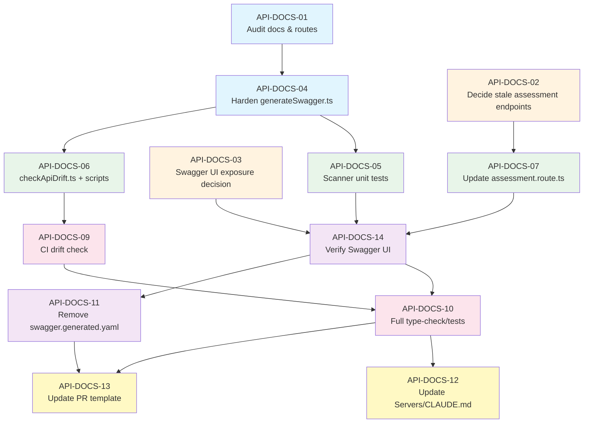

# Task Board: API Documentation Unification

## 1. Initiative Metadata

| Field | Value |
|-------|-------|
| **Initiative name** | API Documentation Unification & Drift Elimination |
| **Classification** | Large (cross-cutting: backend generators, route hygiene, CI, docs, process) |
| **One-line goal** | Make Express route files the single source of truth so that `swagger.yaml`, the frontend endpoint registry, and Swagger UI stay synchronized automatically and fail CI on drift. |
| **PRD** | `docs/plans/PRD-api-documentation-unification.md` |
| **Architecture Brief** | `docs/plans/ARCHITECTURE_BRIEF-api-documentation-unification.md` |
| **UX Assessment** | `docs/plans/UX_ASSESSMENT-api-documentation-unification.md` |
| **Design phase** | Skipped per UX assessment — no UI/UX changes required |

---

## 2. Dependency Graph

### Legend

- Blue: Discovery / foundation
- Orange: Architecture / product decisions
- Green: Generator / route implementation
- Purple: Regeneration / artifact cleanup
- Pink: CI / quality validation
- Yellow: Documentation / process

---

## 3. Task Table

| Task ID | Description | Assigned agent role | Dependencies | Estimated effort | Acceptance criteria | Output artifacts / files changed |
|---------|-------------|---------------------|--------------|------------------|---------------------|----------------------------------|
| **API-DOCS-01** | Audit current API docs and registered Express routes. Compare `Servers/swagger.yaml`, `Servers/swagger.generated.yaml`, `Servers/app.ts`, and `Servers/routes/*.route.ts` to identify: (a) routes missing from the OpenAPI spec, (b) operations missing from the code, (c) the 26 protected endpoints without `bearerAuth`, and (d) the 4 stale assessment endpoints. | Senior Backend Developer | — | S (4–6 h) | 1. A gap report is produced listing every unmatched route/operation with method, path, and source file.  2. The 26 JWT-protected endpoints missing `bearerAuth` are explicitly enumerated.  3. The 4 stale assessment endpoints are listed with current file locations. | `docs/plans/API_DOC_GAP_AUDIT.md` (new; or inline comments in the task artifact) |
| **API-DOCS-02** | Decide the fate of the 4 stale assessment endpoints (`createAssessment`, `saveAnswers`, `updateAssessmentById`, `updateAnswers`, `deleteAssessmentById`) with Product. Document whether each is re-enabled + implemented/verified or permanently removed from the API surface and docs. | Technical Lead (+ Product Manager) | — | S (2–4 h) | 1. A written decision record exists for each of the 4 endpoints (keep or remove).  2. If kept, corresponding controller/route wiring is confirmed feasible.  3. If removed, the decision is recorded as input to API-DOCS-07. | `docs/plans/ASSESSMENT_ENDPOINT_DECISION.md` (new) |
| **API-DOCS-03** | Decide Swagger UI exposure policy: whether `/api/docs` is restricted to non-production environments, gated behind auth, or left open; and confirm the spec uses only `bearerAuth` with no hard-coded example tokens. | Technical Lead | — | XS (1–2 h) | 1. Decision is recorded in the task artifact.  2. If production is restricted, the gating rule is specified (env check, auth check, or both). | Decision note added to `docs/plans/API_DOC_GAP_AUDIT.md` or standalone file |
| **API-DOCS-04** | Harden `Servers/scripts/generateSwagger.ts`. Improve parsing of `Servers/app.ts` (sub-routers, dynamic imports, `.js` imports, factory routers) and route files (multi-line definitions, router-level `authenticateJWT`, middleware aliases such as `authorize`, `superAdminOnly`, upload middleware, rate limiters). Change output target to `Servers/swagger.yaml`. Add `bearerAuth` inference and operation-id uniqueness. Preserve existing tags/summaries via a curated tag map where possible. | Senior Backend Developer | API-DOCS-01 | M (8–12 h) | 1. `npm run generate:swagger` runs without errors and emits `Servers/swagger.yaml`.  2. Generated operation count is within ±2 of the known registered route count (~560).  3. Every detected `authenticateJWT`/`superAdminOnly` route emits `security: [{ bearerAuth: [] }]`.  4. No duplicate operationIds exist.  5. Output remains OpenAPI 3.0.x valid. | `Servers/scripts/generateSwagger.ts` |
| **API-DOCS-05** | Add unit tests for the hardened scanner. Cover `parseIndexFile`, `parseRouteFile`, tag derivation, auth inference, operation-id generation, and edge cases such as sub-routers and middleware aliases. | Senior Backend Developer | API-DOCS-04 | M (6–10 h) | 1. `npm test` in `Servers/` includes new scanner tests and they pass.  2. Tests cover at least 80% of the scanner logic.  3. Each test has a clear pass/fail assertion and no external network/DB dependencies. | `Servers/scripts/__tests__/generateSwagger.test.ts` (new) |
| **API-DOCS-06** | Implement `Servers/scripts/checkApiDrift.ts` and wire it into `Servers/package.json` as `check:api-drift`. Add `generate:swagger` and `generate:endpoints` scripts. The drift checker loads the Express app without starting the server, walks the route stack, compares `(method, path)` pairs to `Servers/swagger.yaml`, applies an explicit allow-list, and prints actionable mismatch output. | Senior Backend Developer | API-DOCS-04 | M (8–12 h) | 1. `npm run check:api-drift` exits 0 when all routes match the spec and non-zero with a clear list of mismatches.  2. Allow-list is configurable (env var or JSON file) and documented.  3. Output includes method, full path, and source route file for every mismatch. | `Servers/scripts/checkApiDrift.ts`, `Servers/package.json` |
| **API-DOCS-07** | Update `Servers/routes/assessment.route.ts` per the API-DOCS-02 decision. Re-enable and verify kept endpoints, or remove commented-out route/controller wiring for removed endpoints. Update `Servers/swagger.yaml` and generated artifacts to match. | Senior Backend Developer | API-DOCS-02, API-DOCS-04 | S (3–6 h) | 1. No commented-out route registrations remain unless explicitly kept and active.  2. `Servers/swagger.yaml` contains only assessment operations that are actually wired in code.  3. Drift check passes for assessment routes. | `Servers/routes/assessment.route.ts`, `Servers/swagger.yaml` |
| **API-DOCS-08** | Regenerate `Servers/swagger.yaml` and `docs/api-docs/src/config/endpoints.ts` from the hardened generator. Fix the 26 missing `bearerAuth` declarations and any scanner-induced mismatches identified in API-DOCS-01. Ensure `endpoints.ts` operation count equals `swagger.yaml` operation count. | Senior Backend Developer | API-DOCS-04, API-DOCS-05, API-DOCS-07 | L (12–18 h) | 1. `npm run generate:swagger && npm run generate:endpoints` completes in under 30 seconds.  2. `Servers/swagger.yaml` contains exactly the same number of operations as `docs/api-docs/src/config/endpoints.ts`.  3. Zero protected endpoints are missing `bearerAuth`.  4. `npm run check:api-drift` passes. | `Servers/swagger.yaml`, `docs/api-docs/src/config/endpoints.ts` |
| **API-DOCS-09** | Add CI drift-check and security-lint job to `.github/workflows/backend-checks.yml`. Run `generate:swagger`, `generate:endpoints`, `check:api-drift`, and a security-lint step that fails if any `authenticateJWT` route lacks `bearerAuth` in the generated spec. | DevOps Engineer | API-DOCS-06, API-DOCS-08 | M (6–10 h) | 1. CI job runs on every PR touching `Servers/**`.  2. CI fails when `check:api-drift` returns non-zero. <br3. CI fails when the security linter finds a protected operation without `security: [{ bearerAuth: [] }]`.  4. CI error logs are actionable. | `.github/workflows/backend-checks.yml` |
| **API-DOCS-10** | Run full backend build + tests and frontend type-check/tests against the regenerated artifacts. Confirm no consumers of `docs/api-docs/src/config/endpoints.ts` break and that Swagger UI renders at `/api/docs`. | QA Engineer | API-DOCS-08, API-DOCS-09 | M (6–10 h) | 1. `Servers/` build passes (`npm run build` or equivalent).  2. All backend unit/integration tests pass.  3. `Clients/` type-check passes (`tsc --noEmit`).  4. Swagger UI loads `/api/docs` and displays operations matching `Servers/swagger.yaml`. | Test run report (captured in CI logs or QA sign-off note) |
| **API-DOCS-11** | Remove or deprecate `Servers/swagger.generated.yaml`. If removal risks breaking external consumers, add a deprecation comment and redirect consumers to `Servers/swagger.yaml`; otherwise delete the file and update any references. | Senior Backend Developer | API-DOCS-08 | S (2–4 h) | 1. `Servers/swagger.generated.yaml` is either deleted or contains a deprecation header pointing to `Servers/swagger.yaml`.  2. No active code or CI step references `swagger.generated.yaml` as the canonical spec.  3. Build and drift check still pass. | `Servers/swagger.generated.yaml` (deleted or deprecated), any reference files |
| **API-DOCS-12** | Update `Servers/CLAUDE.md` with the route → regenerate → verify workflow. Describe how to add a new route, run `generate:swagger`/`generate:endpoints`, run `check:api-drift`, and how `bearerAuth` inference works. Include the Swagger UI exposure decision from API-DOCS-03. | Senior Backend Developer | API-DOCS-08, API-DOCS-09 | S (3–5 h) | 1. `Servers/CLAUDE.md` contains a section titled “API documentation workflow” or equivalent.  2. Steps are copy-pasteable commands.  3. The Swagger UI exposure policy is documented. | `Servers/CLAUDE.md` |
| **API-DOCS-13** | Update `.github/pull_request_template.md` with an API documentation checklist item. Require PR authors to confirm that any new/modified endpoint is reflected in the generated OpenAPI spec and has the correct `bearerAuth` declaration. | Technical Lead | API-DOCS-08 | XS (1–2 h) | 1. PR template includes at least one checkbox referencing generated OpenAPI spec updates.  2. PR template includes a checkbox referencing `bearerAuth` for JWT-protected endpoints. | `.github/pull_request_template.md` |
| **API-DOCS-14** | Verify Swagger UI serves the freshly generated `Servers/swagger.yaml` at `/api/docs`. Confirm the spec is loaded from `Servers/swagger.yaml`, not from `swagger.generated.yaml` or an in-memory object diverging from the file. | Senior Backend Developer | API-DOCS-03, API-DOCS-08 | S (2–4 h) | 1. `Servers/app.ts` reads `swagger.yaml` from disk (or a build copy) for Swagger UI.  2. Changing `Servers/swagger.yaml` and restarting the server is reflected at `/api/docs`.  3. No hard-coded JWT examples appear in the rendered spec. | `Servers/app.ts` (if changes required) |

---

## 4. Wave Grouping

### Wave 1 — Discovery & Decisions
*Goal: Establish facts, make architectural/product decisions, and provide inputs to implementation.*

- API-DOCS-01 — Audit current docs and registered routes
- API-DOCS-02 — Decide fate of 4 stale assessment endpoints
- API-DOCS-03 — Decide Swagger UI exposure policy

### Wave 2 — Generator Hardening
*Goal: Make the code-first scanner robust enough to be the single source of truth.*

- API-DOCS-04 — Harden `Servers/scripts/generateSwagger.ts`
- API-DOCS-05 — Add scanner unit tests

### Wave 3 — Drift Prevention & Route Hygiene
*Goal: Implement the drift checker, resolve stale endpoints, and regenerate artifacts.*

- API-DOCS-06 — Implement `Servers/scripts/checkApiDrift.ts` + package scripts
- API-DOCS-07 — Update `Servers/routes/assessment.route.ts` per product decision
- API-DOCS-08 — Regenerate `Servers/swagger.yaml` and `docs/api-docs/src/config/endpoints.ts`; fix `bearerAuth` gaps

### Wave 4 — CI & Quality Validation
*Goal: Embed the checks in CI and validate the full stack.*

- API-DOCS-09 — Add CI drift-check and security-lint job
- API-DOCS-10 — Run full backend + frontend type-check/tests
- API-DOCS-11 — Remove/deprecate `Servers/swagger.generated.yaml`

### Wave 5 — Documentation & Process
*Goal: Capture the workflow in team runbooks and PR process.*

- API-DOCS-12 — Update `Servers/CLAUDE.md`
- API-DOCS-13 — Update `.github/pull_request_template.md`
- API-DOCS-14 — Verify Swagger UI loads regenerated spec

---

## 5. Blockers / Risks

Copied from the Architecture Brief and assigned owners.

| # | Risk | Impact | Mitigation | Owner |
|---|------|--------|------------|-------|
| 1 | The route scanner cannot reliably parse all ~560 route variations (sub-routers, dynamic imports, factory routers, middleware aliases, `.js` imports). | High — CI drift check produces false negatives/positives. | Start with the existing `generateSwagger.ts` scanner, add unit tests for each route file shape, validate output count against the known ~560 endpoints, and maintain an explicit allow-list for edge cases rather than disabling the check. | Senior Backend Developer |
| 2 | Regenerating `swagger.yaml` loses richer hand-written metadata (descriptions, examples, schemas, tags) currently present in `Servers/swagger.yaml`. | Medium — docs become shallow. | Merge strategy: generated skeleton (paths, methods, auth) plus curated overlays for descriptions/schemas; or accept shallow first pass and enrich incrementally with JSDoc/`x-*` extensions. | Technical Lead |
| 3 | `docs/api-docs/src/config/endpoints.ts` changes shape and breaks consumers/tests. | Medium — frontend build or tests fail. | Audit all imports before regeneration; keep the exported interfaces stable; add a frontend type-check step to CI if not already present. | QA Engineer |
| 4 | Swagger UI in production exposes endpoint shapes and security metadata. | Low/Medium — information disclosure. | Default to serving Swagger UI only when `NODE_ENV !== "production"`, or gate it behind authentication/authorization; document the decision in `Servers/CLAUDE.md`. | Technical Lead |
| 5 | Large one-time regeneration of 280+ documented operations creates an unreviewable PR. | High — merge conflicts and review fatigue. | Break the work into small, reviewable commits: (1) scanner hardening + tests, (2) regenerate `swagger.yaml` and fix auth gaps, (3) stale assessment cleanup, (4) CI drift check + scripts, (5) docs/template updates. Prefer one file per commit where possible. | Technical Lead |

---

## 6. Open Questions

Unresolved questions that must be answered before or during implementation.

| # | Question | Blocking tasks | Owner to resolve |
|---|----------|----------------|------------------|
| 1 | Should route metadata be expressed as JSDoc comments, TypeScript decorators, or a separate route registry module? | API-DOCS-04 | Technical Lead |
| 2 | Do we want to generate request/response schemas from Zod validation schemas, JSDoc types, or controller return types? | API-DOCS-04 (schema depth only) | Technical Lead |
| 3 | Should Swagger UI be exposed in production, or only in development/staging? | API-DOCS-03, API-DOCS-14 | Product Manager + Technical Lead |
| 4 | Are there any intentionally undocumented routes (e.g., internal health checks, admin debug routes) that should be excluded from the drift check? | API-DOCS-01, API-DOCS-06 | Technical Lead |
| 5 | What is the desired output format and location for the generated `endpoints.ts` — keep `Servers/endpoints.ts`, move it to `docs/api-docs/src/config/endpoints.ts`, or both? | API-DOCS-08 | Technical Lead |
| 6 | Should the 4 stale assessment endpoints be re-implemented, or permanently removed from the product surface? | API-DOCS-02, API-DOCS-07 | Product Manager |
| 7 | Does the frontend repository layer (`Clients/src/application/repository/*.repository.ts`) consume `docs/api-docs/src/config/endpoints.ts`, or should this initiative also generate a registry inside `Clients/src/`? | API-DOCS-08, API-DOCS-10 | Technical Lead + Senior Frontend Developer |
